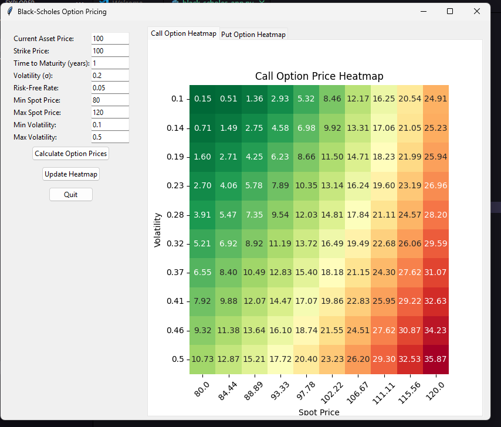
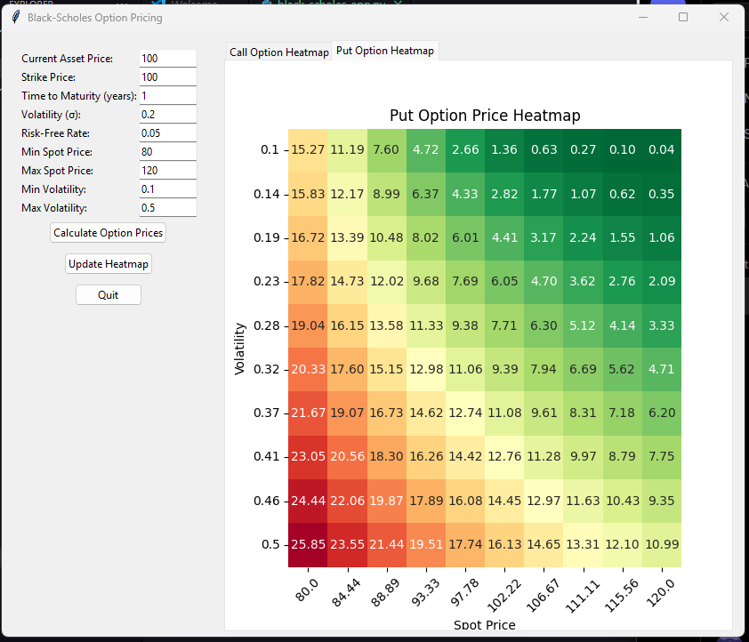

# Black-Scholes Option Pricing App

## 📌 Overview
A Python GUI application that calculates and visualizes European option prices using the Black-Scholes model. Perfect for traders, students, and finance enthusiasts.

## ✨ Features
- **Instant pricing** for call & put options
- **Interactive heatmaps** showing price sensitivity to:
  - Underlying asset price (x-axis)
  - Volatility (y-axis)
- **User-friendly interface** with adjustable parameters
- **Real-time updates** when inputs change

## 🛠️ Requirements
- Python 3.6+
- Required packages: numpy matplotlib seaborn scipy tkinter
- Install with: pip install numpy matplotlib seaborn scipy

## 🚀 How to Run
1. Clone this repository
2. Navigate to project directory
3. Run: python black_scholes_app.py

## 🎯 Use Cases
- **Traders**: Quickly estimate fair option prices
- **Students**: Learn option pricing dynamics visually
- **Risk Analysis**: Test how market changes affect options

## ⚙️ Parameters You Can Adjust
- Spot price, strike price, time to maturity
- Volatility, risk-free rate
- Custom ranges for heatmap analysis

## 📊 Sample Output

Call Price: $X.XX  
Put Price: $X.XX

## 📜 License
MIT License - Free for educational and commercial use
